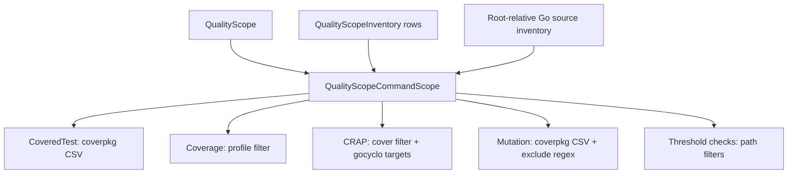

# Quality Scope Command Plan

## Non-Negotiable Contract

- No public API changes. Do not change exported function signatures, exported option names, exported token types, or documented caller composition.
- Do not add compatibility shims, adapters, deprecated wrappers, fallback paths, or parallel implementations.
- Prefer breaking internal changes over preserving internal helper compatibility. Delete or replace duplicated internal builders.
- Quality scope is the canonical measurement statement for production code. It is not a passthrough argument mechanism.
- Production visibility build tags must enter inventory-consuming quality steps only through `QualityScope.Tags()`. Generic `TestArgs` or `MutationArgs` containing `-tags`, `--tags`, `-tags=...`, or `--tags=...` must be rejected before tool execution.
- One `QualityScopeInventory` plus one `QualityScope` produces one internal command scope per step invocation. If a step also needs the root-relative `.go` source inventory, that inventory is gathered once before constructing the command scope and passed into the constructor.
- Minimal means: emit the smallest command input that expresses the scope for that tool. Use package CSVs for package tools, directory regexes where a directory excludes all children, and file regexes only where a wider exclusion would remove in-scope code.



## Exact Command Contracts

- `QualityScopeInventory`: `go list -e [-tags=<tags>] -f <package-inventory-format> <qualityScope.packages>`. Excludes and test file patterns do not affect this command.
- `CoveredTest`: `go test <PackageScope> -json -coverprofile=<artifact>/coverage.out -coverpkg=<minimal-import-csv> [-tags=<tags>] ... -count=1`. The CSV is built once by the shared command scope. Generic covered-test args that carry build tags are rejected.
- `Coverage`: `go tool cover -func=<artifact>/coverage.out` when no file-level scope filter applies. Use `go tool cover -func=<artifact>/coverage-filtered.out` when exclude segments or test file patterns remove coverage profile lines.
- `Crap`: use the same active coverage profile contract as `Coverage`. Run one resolved gocyclo command for all planned complexity targets. If the resolver selects a local binary, the command is `gocyclo -over 0 [CrapArgs...] <target>...`; if it selects `go run`, the command is `go run <gocycloSpec> -over 0 [CrapArgs...] <target>...`. The BDD diffs below assert the `go run` form because the feature harness default for the new scenarios resolves missing tools through the pinned spec. Targets are host package directories for in-scope packages after package-level excludes. Because `gocyclo` has no file-exclude argv, file-level exclusions from path segments and test-file patterns must be applied when parsing gocyclo output with the same planned path filters.
- `MutationRunner.Scan`: `gremlins unleash -o <artifact>/mutations.json --coverpkg=<minimal-import-csv> [--tags=<tags>] [--exclude-files=<minimal-regex>]... --dry-run [MutationArgs...]`, or the equivalent `go run <gremlinsSpec> unleash ...` when the resolver selects `go run`. Dry-run is required for scan.
- `MutationRunner.Kill` and `MutationKills`: `gremlins unleash -o <artifact>/mutations.json --coverpkg=<minimal-import-csv> [--tags=<tags>] [--exclude-files=<minimal-regex>]... [MutationArgs...]`, or the equivalent `go run <gremlinsSpec> unleash ...` when the resolver selects `go run`. Dry-run must not appear in full-run kill commands. Generic mutation args that carry build tags are rejected.
- `MutationSites` and `MutationCoverage`: no subprocess argv change. They consume the command scope's normalized mutation path filters and must not reconstruct parsing or matching rules locally.
- `Duration`: no subprocess argv change and no shared quality-scope command-scope projection. Preserve the current per-test elapsed-time invariant; do not add Duration to quality-scope command parity.

## Builder Ownership

Implement the shared translation in `internal/gatecheck`. Do not put command-scope translation in public `gate` APIs or in step-specific harness helpers.

Required ownership:
- `internal/gatecheck/quality_scope_command_scope.go`: define the aggregate internal command-scope type and constructor from inventory rows, canonical root-relative `.go` source inventory, raw exclude-segment string, test file patterns, and tags. The constructor is the single canonical parse boundary for exclude segments; it stores canonical parsed filters and exposes projections. Consumers must never reparse raw scope strings.
- Projection preconditions: coverpkg, coverage-profile, CRAP, and threshold-filter projections may be built without source inventory; mutation exclude-file projections require source inventory and must fail explicitly when it is absent.
- `internal/gatecheck/coverpkg.go`: keep import-path matching and expose the command scope's minimal import CSV helper from here or through the plan file.
- `internal/gatecheck/gremlins_exclude.go`: keep regex serialization and minimization; make the command scope use it instead of duplicating it.
- `internal/gatecheck/coverage.go`: keep profile filtering; make the command scope expose whether filtering is needed and which filters apply.

Required duplication removal:
- Remove `coverpkgFromQualityScopeRows` from `internal/harness/step_mutation.go`; replace all callers with the shared command-scope projection.
- Remove local `ParseExcludeSegments` calls from `internal/harness/steps_basic.go`, `internal/harness/step_coverage.go`, `internal/harness/step_crap.go`, and `internal/harness/step_mutation.go` where they duplicate command-scope state.
- Replace `crapDirsFromRows` as a scope translator. Keep only host path projection needed to execute planned `gocyclo` targets.
- Keep `runGremlinsUnleash`, `buildTestArgs`, and `writeGocycloReport` as command assembly/execution only; they must not decide scope.
- BDD expected-argv helpers must remain independent actor-level oracles. Do not derive BDD expected command lines from the production `gatecheck` command scope. Delete leaky helper duplication where possible; keep only literal placeholder formatting and command-log normalization.

## Verbatim BDD Feature Diffs

Apply these feature changes before implementation. These diffs use only existing BDD step definitions.

### `features/quality_scope_inventory.feature`

```diff
@@
   Scenario: records package inventory for the configured quality scope
@@
       ./zz_bdd_not_default/...
       """
+
+  Scenario: quality-scope tags affect inventory discovery
+    Given the quality scope has build tag "mage"
+    And the quality scope has build tag "integration"
+    When the gate runs steps qualityscopeinventory
+    Then the step passes
+    And the command `go` is run with arguments:
+      """
+      list
+      -e
+      -tags=mage,integration
+      -f
+      <package-inventory-format>
+      ./zz_bdd_not_default/...
+      """
+
+  Scenario: quality-scope excludes do not narrow inventory discovery
+    Given the quality scope excludes "testutil"
+    When the gate runs steps qualityscopeinventory
+    Then the step passes
+    And the command `go` is run with arguments:
+      """
+      list
+      -e
+      -f
+      <package-inventory-format>
+      ./zz_bdd_not_default/...
+      """
```

### `features/coveredtest.feature`

```diff
@@
   Scenario: quality scope excludes narrow the measurement boundary
@@
       -coverpkg=example.com/mod/zz_bdd_not_default/pkg
       -count=1
       """
+
+  Scenario: quality-scope tags affect covered test instrumentation
+    Given the codebase has 95% test coverage
+    And the quality scope has build tag "mage"
+    And the quality scope has build tag "integration"
+    And the output mode is agent
+    When the gate runs steps qualityscopeinventory, coveredtest
+    Then the step passes
+    And the command `go` is run with arguments:
+      """
+      test
+      ./zz_bdd_not_default/...
+      -json
+      -coverprofile=<artifact>/coverage.out
+      -coverpkg=example.com/mod/zz_bdd_not_default/pkg,example.com/mod/zz_bdd_not_default/testutil
+      -tags=mage,integration
+      -count=1
+      """
```

### `features/coverage.feature`

```diff
@@
   Scenario: quality scope excludes narrow the measurement boundary
@@
       -coverpkg=example.com/mod/zz_bdd_not_default/pkg
       -count=1
       """
+    And the command `go` is run with arguments:
+      """
+      tool
+      cover
+      -func=<artifact>/coverage-filtered.out
+      """
+
+  Scenario: unfiltered quality scope uses the raw coverage profile
+    Given the codebase has 95% test coverage
+    And the output mode is agent
+    When the gate runs steps qualityscopeinventory, coveredtest, coverage
+    Then the step passes
+    And the command `go` is run with arguments:
+      """
+      tool
+      cover
+      -func=<artifact>/coverage.out
+      """
```

### `features/crap.feature`

```diff
@@
   Scenario: uses the configured quality scope for measurement
@@
       <package-inventory-format>
       ./internal/...
       """
+    And the command `go` is run with arguments:
+      """
+      run
+      github.com/fzipp/gocyclo/cmd/gocyclo@v0.6.0
+      -over
+      0
+      /mod/internal/app
+      """
@@
   Scenario: quality scope excludes narrow the measurement boundary
@@
       -coverpkg=example.com/mod/zz_bdd_not_default/pkg
       -count=1
       """
+    And the command `go` is run with arguments:
+      """
+      tool
+      cover
+      -func=<artifact>/coverage-filtered.out
+      """
+    And the command `go` is run with arguments:
+      """
+      run
+      github.com/fzipp/gocyclo/cmd/gocyclo@v0.6.0
+      -over
+      0
+      /mod/zz_bdd_not_default/pkg
+      """
+
+  Scenario: CRAP runs one gocyclo command for all scoped package directories
+    Given function "Validate" has cyclomatic complexity 5
+    And the codebase has 95% test coverage
+    And the output mode is agent
+    When the gate runs steps qualityscopeinventory, coveredtest, coverage, crap
+    Then the step passes
+    And the command `go` is run with arguments:
+      """
+      run
+      github.com/fzipp/gocyclo/cmd/gocyclo@v0.6.0
+      -over
+      0
+      /mod/zz_bdd_not_default/pkg
+      /mod/zz_bdd_not_default/testutil
+      """
+
+  Scenario: test file patterns filter CRAP coverage input
+    Given function "Validate" has cyclomatic complexity 5
+    And the codebase has 95% test coverage
+    And the quality scope test file patterns include "*_test.go"
+    And the output mode is agent
+    When the gate runs steps qualityscopeinventory, coveredtest, coverage, crap
+    Then the step passes
+    And the command `go` is run with arguments:
+      """
+      tool
+      cover
+      -func=<artifact>/coverage-filtered.out
+      """
```

### `features/mutation_runner_scope.feature`

Existing mutation-scope BDD remains authoritative and must not be weakened or replaced by unit-only assertions. Add only the missing visible no-tool-execution assertion to the existing all-excluded scenario.

```diff
@@
   Scenario: all packages excluded fails before gremlins runs
@@
     When the gate runs steps qualityscopeinventory, mutationscan
     Then the step fails
     And the error is ErrAllPackagesExcluded
+    And the gremlins dry-run command did not run
```

Keep these existing scenarios as behavior requirements, not helper tests:
- `source files outside package inventory are excluded only by quality-scope segments`
- `root module files are escaped as anchored file regexes`
- `metacharacter-bearing source paths are quoted before regex emission`
- `overlapping excludes translate deterministically for mutation suppression`
- `broad test file patterns fail closed when every mutation candidate is excluded`
- `all packages excluded fails before gremlins runs`

Add generic build-tag rejection for mutation arguments:

```diff
@@
   Scenario: quality-scope tags feed inventory and mutation scan
@@
       --tags=mage,integration
       --dry-run
       """
+
+  Scenario: mutation scan rejects generic build-tag arguments
+    Given mutation has an extra argument of "--tags=consumer" specified
+    When the gate runs steps qualityscopeinventory, mutationscan
+    Then the step fails
+    And the error is ErrInvalidOption
+    And the gremlins dry-run command did not run
```


### `features/mutationkills.feature`

Add generic build-tag rejection for full-run mutation arguments.

```diff
@@
   Scenario: quality scope excludes narrow full mutation run
@@
       --exclude-files=^zz_bdd_not_default/testutil(/|$)
       """
+
+  Scenario: mutation kill rejects generic build-tag arguments
+    Given a mutation kills min rate of 0 percent
+    And mutation has an extra argument of "--tags=consumer" specified
+    When the gate runs steps qualityscopeinventory, mutationkills
+    Then the step fails
+    And the error is ErrInvalidOption
+    And the step does not dispatch any commands
```

### `features/mutationcoverage.feature`

```diff
@@
   Scenario: test file patterns are excluded from mutation metrics
@@
     Then the step passes
     And the mutation-coverage evaluation did not include "pkg/foo_test.go"
+
+  Scenario: configured quality scope narrows mutation coverage command input
+    Given a mutation coverage min of 80 percent
+    And the quality scope is "./internal/..."
+    And the module "example.com/mod" has package "example.com/mod/internal/app" at "/mod/internal/app"
+    And the output mode is agent
+    When the gate runs steps qualityscopeinventory, mutationscan, mutationcoverage
+    Then the step passes
+    And the command `go` is run with arguments:
+      """
+      run
+      github.com/hotchkj/gremlins/cmd/gremlins@v0.6.1-pre.1
+      unleash
+      -o
+      <artifact>/mutations.json
+      --coverpkg=example.com/mod/internal/app
+      --dry-run
+      """
```

## BDD Step Definitions

No new BDD step definitions are required by this plan. Do not add step definitions. Existing step phrases already cover:
- `Given the quality scope has build tag "..."`
- `Given the quality scope excludes "..."`
- `Given the quality scope is "..."`
- `Then the command \`go\` is run with arguments:`
- `Then the mutation-coverage evaluation did not include "..."`
- `Then the gremlins dry-run command did not run`
- `Then the step does not dispatch any commands`
- `Then the error is ErrInvalidOption`

## Unit Test Focus

- Add pure `gatecheck` tests for the command-scope builder: import CSV, profile filter activation, gremlins regex minimization, gocyclo target projection, source-file exclusions outside packages, test-file pattern exclusions, and all-excluded failure.
- Add parity tests proving `CoveredTest`, `Coverage`, `Crap`, mutation scan, mutation kill, `MutationSites`, and `MutationCoverage` consume the same parsed filters for the same inventory and scope.
- Unit tests are supporting evidence for BDD requirements. Do not move any BDD-listed behavior into unit tests only.
- Delete tests that only preserve duplicated helper behavior. Replace them with tests of the shared command scope.

## Phase 5: Minimal Regex Completion For Test-File Patterns

Current implementation violates the "minimal regex" principle by expanding `test_file_patterns = ["*_test.go"]` into one `--exclude-files` flag per known test file. This phase corrects that drift.

### Definition of Minimal Test-File Pattern Regexes

- Test-file pattern regexes for mutation argv must collapse to the smallest safe package-root regex for each otherwise in-scope package directory.
- For the repo's `*_test.go` pattern in a package dir such as `gate`, emit one regex `^gate/.*_test\.go$` that matches all test files, not individual per-file regexes like `^gate/foo_test\.go$` and `^gate/bar_test\.go$`.
- Excluded package dirs (those matching a directory regex like `^cmdtest(/|$)`) must not also emit redundant test-pattern regexes because the directory regex already covers all children.
- Root package dirs (`.`) must remain anchored to root-level files only, not nested packages.
- Preserve concrete file regexes only for source-path excludes that are genuinely file-specific, such as root module files (`^main\.go$`) or source files outside package inventory where no package-level regex is correct.
- Preserve directory regexes for package/path segment excludes unchanged.

### Test-File Pattern Regex Algorithm

In `internal/gatecheck/gremlins_exclude.go`:

1. Filter the package inventory rows to include only packages that are not already covered by directory excludes (e.g., exclude `^cmdtest(/|$)`, `^testdata(/|$)`, etc.).
2. For each remaining in-scope package dir, check if it contains matching test files (e.g., `*_test.go` or `*_xtest.go`).
3. For each in-scope package dir that has matching test files, emit exactly one anchored regex per test-file pattern: e.g., `^gate/.*_test\.go$` for package `gate` and pattern `*_test.go`.
4. Sort all exclude regex args lexicographically after required command arguments (`--coverpkg=...`, `--tags=...`, etc.).
5. Do not emit test-pattern regexes for packages that have no matching test files.

### BDD Contract Update For Test-File Patterns

Update `features/mutation_runner_scope.feature`:

- Replace the scenario `test file patterns become concrete exclude-file arguments` with a new scenario that creates at least two test files in one in-scope package and one test file in a second in-scope package.
- Expected argv must contain exactly one package-level regex per in-scope package (e.g., `--exclude-files=^internal/app/.*_test\.go$` and `--exclude-files=^vendor/lib/.*_test\.go$`).
- Expected argv must NOT contain per-file test regexes (e.g., must not contain `--exclude-files=^internal/app/foo_test\.go$` or `--exclude-files=^internal/app/bar_test\.go$`).
- Add a scenario proving excluded packages plus `*_test.go` emit `^internal/testutil(/|$)` but do not also emit `^internal/testutil/.*_test\.go$`.

### Anti-Bullshit Enforcement For Phase 5

- Any dogfood mutation scan with more test-file `--exclude-files` flags than in-scope package dirs **fails** the plan.
- For pattern-only test exclusions, emitted test-pattern exclude count MUST equal the number of otherwise in-scope package dirs that contain matching test or xtest files. It MUST NOT equal the number of matching test files.
- Any BDD expected argv that names a specific `*_test.go` file for a test-file-pattern-only exclusion **fails** the plan, unless the scenario is specifically about an explicit file path exclusion.
- Any implementation that preserves per-file test regexes and only sorts/deduplicates them **fails** the plan.

### Verification For Phase 5

1. Run targeted BDD for `features/mutation_runner_scope.feature` and `features/mutationkills.feature`, proving the old concrete-per-file expectation fails before implementation and the new exact minimal-regex expectation passes after.
2. Run targeted Go tests for `internal/gatecheck/gremlins_exclude_test.go` and `internal/gatecheck/quality_scope_command_scope_test.go`, proving:
   - Multiple test files in the same in-scope package emit one package regex.
   - Multiple in-scope packages emit one regex per package dir.
   - Excluded packages do not emit redundant test-pattern regexes.
   - Root package behavior does not accidentally match nested packages.
   - File-specific excludes still emit concrete file regexes when a wider regex would remove in-scope code.
3. Capture exact dogfood argv for mutation scan and mutation kill commands after implementation, proving test-file regexes are minimal (package-level, not per-file).
4. Confirm `git status` has no trace/debug artifacts, no `.gitignore` changes for local artifacts, and no temporary threshold changes.

## Phasing And Change Size

Do this as small reviewable phases. Do not combine all work into one unreadable diff.

1. BDD contract phase:
   - Apply only the feature-file diffs listed above and any required updates to existing BDD expected-argv helpers.
   - BDD helper updates are allowed only for existing step plumbing, literal placeholder formatting, and command-log normalization. They must not call or mirror the production `gatecheck` command scope.
   - Run only targeted BDD for changed feature files and confirm the new scenarios fail for the expected command-contract reason: mismatched argv, missing filtered profile use, missing no-tool-execution assertion, or missing scoped evaluation effect. They must not fail because a step phrase is undefined.
   - Commit this phase separately if the user has asked for commits.
2. Shared command-scope phase:
   - Add `internal/gatecheck/quality_scope_command_scope.go` and pure command-scope tests.
   - Do not update harness consumers in the same edit cycle unless the command-scope tests cannot compile without minimal call-site movement.
   - If compile-motivated movement would leave both old and new production scope translators active, do not commit this phase separately; continue through the harness consumer phase and commit the combined internal rewrite only after duplicated production translators are removed.
   - Commit this phase separately if the user has asked for commits.
3. Harness consumer phase:
   - Update `CoveredTest`, `Coverage`, `Crap`, mutation scan/kill, `MutationSites`, and `MutationCoverage` to use command-scope projections.
   - Do not change `Duration` as part of quality-scope command-scope parity.
   - Delete replaced duplication in the same phase; do not leave old helpers behind.
   - Run targeted BDD and unit tests for the touched steps.
   - Commit this phase separately if the user has asked for commits.
4. Cleanup and parity phase:
   - Remove obsolete BDD/helper duplication.
   - Add cross-step parity tests.
   - Run lint/static analysis plus the full gate.
   - Commit this phase separately if the user has asked for commits.

## Sub-Agent Usage Strategy

Use subagents to keep review surface controlled, not to fragment ownership.

- Use one `task-executor` for BDD contract edits only. Scope: `features/*.feature` plus existing BDD command assertion helpers if needed. It must not touch production code.
- Use one `task-executor` for the pure `internal/gatecheck` command-scope builder and command-scope tests. Scope: `internal/gatecheck`.
- Use one `task-executor` for harness consumer rewiring. Scope: `internal/harness` and only the `gate` files needed to pass the command scope into harness without public API changes. Exclude `Duration` unless a compile-only adjustment is required by removed duplicate parsing.
- Run one `critical-reviewer` after the BDD and command-scope-builder phases to catch contract drift before harness edits.
- Run one `critical-reviewer` after harness rewiring to check duplication removal, no public API changes, and no internal compatibility shims.
- Do not launch parallel writers against overlapping files. Shared interface is the `gatecheck` command-scope type; define or review it before any harness subagent starts.

Each subagent prompt must include: this plan path, `docs/mage-gate-intent-and-design.md`, `docs/kb/coding-standards.md`, `docs/kb/verification.md`, and the non-negotiable no-public-API/no-shim constraints.

## Review Strategy

Run reviews at these gates:

- Plan review before implementation: logical consistency and plan-vs-intent review.
- BDD review after feature diffs: every scenario must be actor-visible and must not expose internal helper mechanics.
- Implementation review after shared command scope + harness rewiring: no duplicated scope translation, no public API changes, no compatibility layers, no production path that keeps old and new scope translators active together, and no `Duration` semantic drift.
- Final review before completion: reconcile reviewer findings against targeted tests, lints, and full gate output.

Reviewer findings are hypotheses until reconciled with repo-local evidence. Do not mark complete while any reviewer finding is unresolved or intentionally rejected without evidence.

## Commit And PR Cadence

Use this cadence:

- Commit 1: BDD contract changes only.
- Commit 2: shared `gatecheck` command-scope builder and tests, only if it does not leave active parallel production translators.
- Commit 3: harness/gate consumer rewiring plus deletion of duplicated builders. If commit 2 could not stand alone without active dual translators, combine commits 2 and 3 into one internal rewrite commit.
- Commit 4: cleanup, parity tests, and verification fixes.

If any phase becomes too large to review comfortably, split by affected step family: coverage/CRAP first, mutation command producers second, mutation threshold consumers third. Never split by leaving both old and new scope translators active in production code.

PR description must explain behavior by quality-scope usage, not by helper/file inventory. Include the targeted BDD list and full gate result.

## Verification

- Run targeted BDD for exactly these changed feature files: `features/quality_scope_inventory.feature`, `features/coveredtest.feature`, `features/coverage.feature`, `features/crap.feature`, `features/mutation_runner_scope.feature`, `features/mutationkills.feature`, and `features/mutationcoverage.feature`.
- Run targeted Go unit tests for `internal/gatecheck`, `internal/harness`, and `gate` inventory consumers.
- Run repo lints after implementation.
- Run the full gate before completion, because this touches shared quality-scope semantics.
